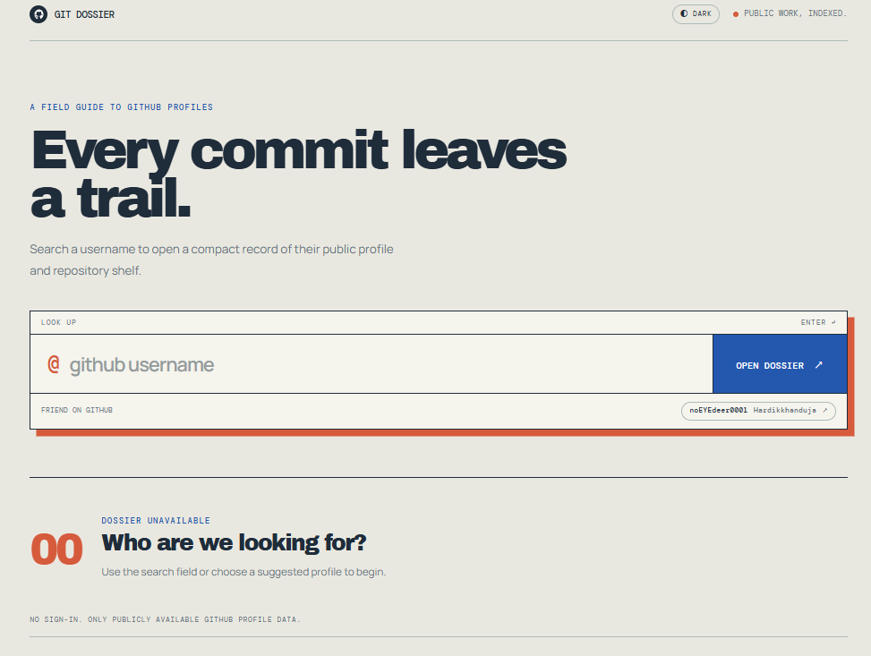

# 🐙 GitHub User Fetcher

A modern React-based web application that allows users to search for GitHub profiles and explore their public repositories using the GitHub REST API.

The project focuses on practicing React Hooks, API integration, asynchronous JavaScript, state management, and dynamic rendering.

---



---

---

## ✨ Features

- 🔍 Search GitHub users by username
- 👤 Display GitHub profile information
- 🖼️ Display profile avatar
- 📝 Display user bio
- 👥 Show followers and following count
- 📦 Display total public repositories
- 🔗 Open GitHub profile directly
- 📚 Display public repositories dynamically
- 📄 Show repository descriptions
- 🚀 Open individual repositories
- ⚡ Fetch real-time data from GitHub API
- 📱 Responsive and modern UI

---

## 🛠️ Tech Stack

| Technology | Purpose |
|---|---|
| React.js | Frontend UI |
| JavaScript | Application Logic |
| CSS3 | Styling and Responsive Design |
| Vite | Development & Build Tool |
| GitHub REST API | Fetch User & Repository Data |

---

## 🔌 API Integration

This project uses the **GitHub REST API** to fetch user profiles and repositories.

### 👤 User Profile API

```text
https://api.github.com/users/{username}

This endpoint is used to fetch:

GitHub username
Profile avatar
Bio
Followers
Following
Public repository count
GitHub profile URL
📦 Repository API
https://api.github.com/users/{username}/repos

This endpoint is used to fetch the user's public repositories.

Repository information includes:

Repository name
Description
Repository URL
Repository ID
🔄 Application Flow
User enters GitHub username
          │
          ▼
      Click Search
          │
          ▼
    Update search state
          │
          ▼
      useEffect runs
          │
          ├───────────────┐
          ▼               ▼
    User API        Repository API
          │               │
          ▼               ▼
   Profile Data     Repository Data
          │               │
          └───────┬───────┘
                  ▼
          Update React State
                  │
                  ▼
          Render Profile Card
                  │
                  ▼
        Render Repository Cards
⚛️ React Concepts Used
useState

Used to manage application state:

const [user, setUser] = useState("");
const [search, setSearch] = useState("");
const [data, setData] = useState({});
const [Repo, setRepo] = useState([]);

The state manages:

User input
Searched username
Profile information
Repository data
useEffect

Used to trigger the API request whenever the searched username changes.

useEffect(() => {
  if (search.trim() === "") {
    return;
  }

  // API request
}, [search]);
.map()

Used to dynamically render repository cards from the repository array returned by the GitHub API.

Repo.map((repo) => {
  return (
    <div key={repo.id}>
      <h3>{repo.name}</h3>
      <p>{repo.description}</p>
    </div>
  );
});
Conditional Rendering

Used to display dynamic content based on the API response and application state.

📂 Project Structure
Github_User_Fetcher/
│
├── public/
│
├── src/
│   ├── assets/
│   │   └── github.svg
│   │
│   ├── App.jsx
│   ├── App.css
│   ├── index.css
│   └── main.jsx
│
├── .gitignore
├── index.html
├── package.json
├── package-lock.json
├── README.md
└── vite.config.js
⚙️ Getting Started
Prerequisites

Make sure you have the following installed:

Node.js
npm
Git
1. Clone the Repository
git clone https://github.com/Aayush60-del/Github_User_Fetcher.git
2. Navigate to the Project
cd Github_User_Fetcher
3. Install Dependencies
npm install
4. Start the Development Server
npm run dev

Open the local URL provided by Vite in your browser.

🎯 Learning Objectives

This project helped me strengthen my understanding of:

React fundamentals
useState Hook
useEffect Hook
Controlled inputs
State management
Fetch API
REST API integration
Multiple API endpoints
async/await
Handling JSON responses
Conditional rendering
Dynamic rendering with .map()
Working with external API data
Responsive UI development
🔮 Future Improvements

Potential improvements include:

 Add loading state
 Add error handling for invalid usernames
 Add "User not found" message
 Display repository languages
 Display repository stars and forks
 Add repository sorting
 Add repository pagination
 Add GitHub contribution activity
 Add dark/light theme
 Improve mobile responsiveness
 Add GitHub API authentication for higher rate limits
🌐 Live Demo

🚧 Coming Soon

👨‍💻 Author

Aayush

Computer Science Engineering Student interested in:

Full-Stack Development
React.js
Backend Development
AI & Machine Learning
Data Structures & Algorithms
Cloud & DevOps

GitHub: @Aayush60-del

⭐ Support

If you found this project useful or interesting, consider giving the repository a ⭐ on GitHub!
